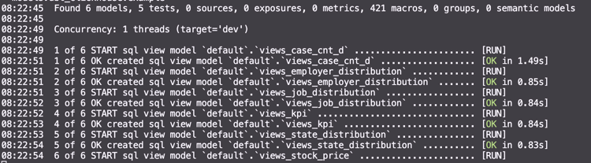

# capstone-project

## Objective
- To provide a comprehensive analysis of H1-B and Permanent visa applications by examining the distribution of applications across various states and job titles, identifying the most common job roles, understanding salary trends, and evaluating approval rates for specific job titles. This analysis aims to offer valuable insights for prospective applicants and employers by highlighting key patterns and trends in visa applications.

## Questions of Analysis
- How are H1-B and Permanent visa applications distributed across different worksiteState?
- What are the most common job titles and roles for H1-B and Permanent visa applicants?
- How are H1-B and Permanent visa applications distributed across different job titles?
- What are the average salaries offered by companies for H1-B and Permanent visa positions?
- What are the approval rates for specific job titles?

## Source Datasets
| Source Name                             | Source Type | Source Documentation                                               |
|-----------------------------------------|-------------|--------------------------------------------------------------------|
| Stock-visa-application (Finnhub)        | API         | [Documentation](https://finnhub.io/docs/api/stock-visa-application)|
| Stream real-time trades for US stocks (Finnhub) | Websockets  | [Documentation](https://finnhub.io/docs/api/websocket-trades)      |
| Nasdaq stock name                       | CSV         | [GitHub Repository](https://github.com/datasets/nasdaq-listings/blob/master/data/nasdaq-listed.csv) |

## Solution Architect

## Steps of Implementation

### 1. Source: Finhub API/Finhub WebSockets
- The data source application is designed to fetch visa applicationa and the real-time US stock trades data
- Implementation of data streaming
    - We utilize a class to create and manage Kafka topics for streaming real-time stock data from Finnhub through a WebSocket connection. This WebSocket provides live updates on stock trades for the top technology companies listed on NASDAQ, as specified in a CSV file. In addition, we fetch historical H1 visa application data for these companies using Finnhub's API.
    - Both types of data are captured and sent to their respective Kafka topics. A connector managed by Confluent Cloud then seamlessly transfers this information from Kafka topics to ClickHouse. This setup ensures that both real-time stock trade data and historical visa application data are efficiently streamed, processed, and stored for further analysis and reporting.
    
    
    - The streaming application is hosted on AWS, with the Docker image pushed to ECR and tasks running on ECS. Environment variables, API credentials, and configuration properties are stored in S3.
    
    
    

### 2. Transform
- Using DBT to manipulate clickhouse, creating transformed views of origin data
- Apply test in DBT to verify the table contents and column restrains

### 3. Dashboard Deployment
- Connecting Preset with Clickhouse in different data sets
- Set the refreshing frequency
- Showing the analytical results by dashboards

### 4. Continuous Integration
- Using Github Action to add a workflow
- Trigger linter check of Python when PR happened in main

## Limitations and Lesson Learned
- Ensure there are no duplications 

